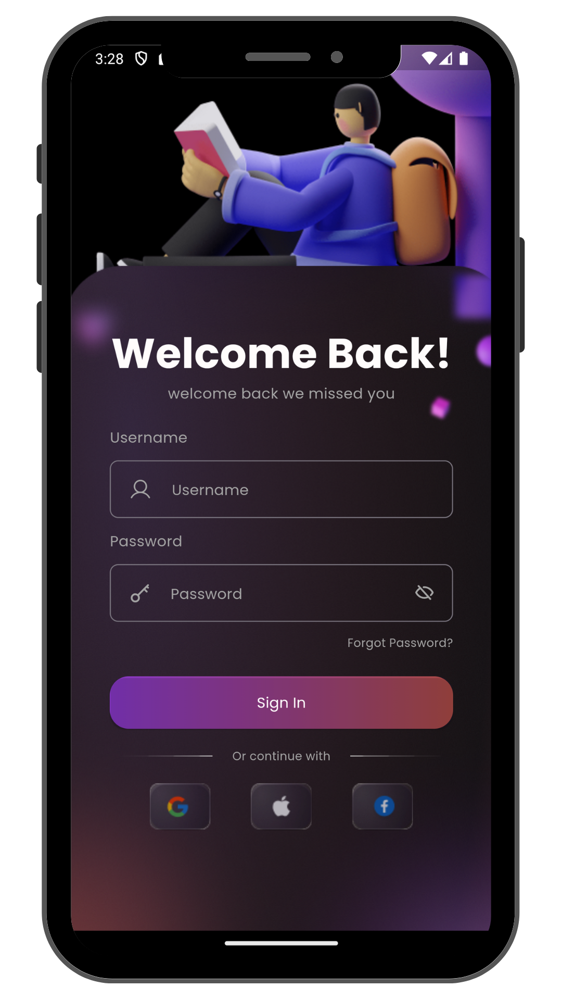
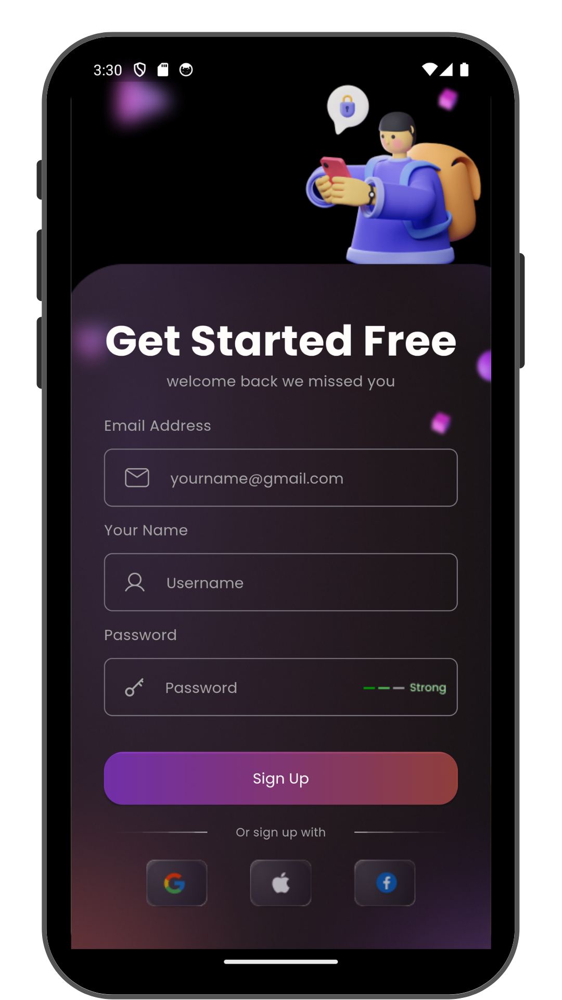

# Flutter Slice Login register Page

I have successfully completed the development of login and register pages using Flutter. This project involved designing a responsive user interface and implementing secure authentication functionality. I utilized Flutter's built-in widgets to create an attractive and user-friendly interface. Additionally, I implemented input validation to ensure the correctness and security of user-entered data. Throughout the development process, I focused on app speed and performance, as well as ensuring consistency in design and user experience. The result is a reliable and satisfying application for users.

    
    <a href="https://www.tiktok.com/@ikbalzohr/video/7332895561969978630" >Coding video</a>

    
    

### Getting Started

This project is a starting point for a Flutter application.
A few resources to get you started if this is your first Flutter project:

- [Lab: Write your first Flutter app](https://docs.flutter.dev/get-started/codelab)
- [Cookbook: Useful Flutter samples](https://docs.flutter.dev/cookbook)

For help getting started with Flutter development, view the
[online documentation](https://docs.flutter.dev/), which offers tutorials,
samples, guidance on mobile development, and a full API reference.
